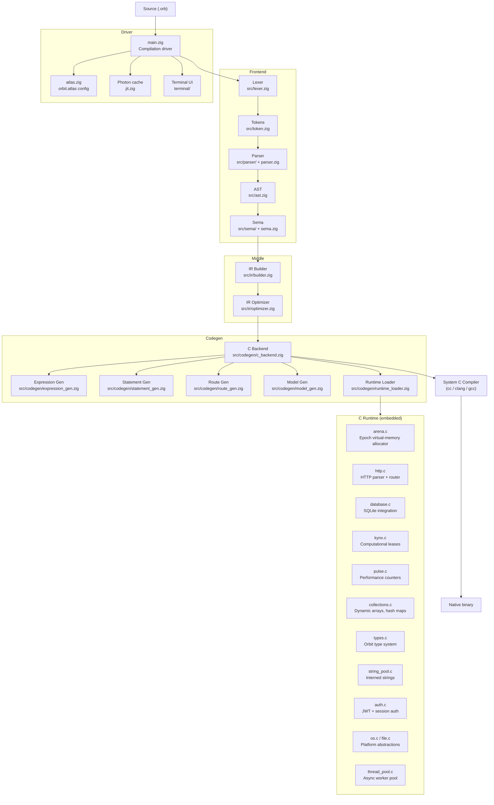
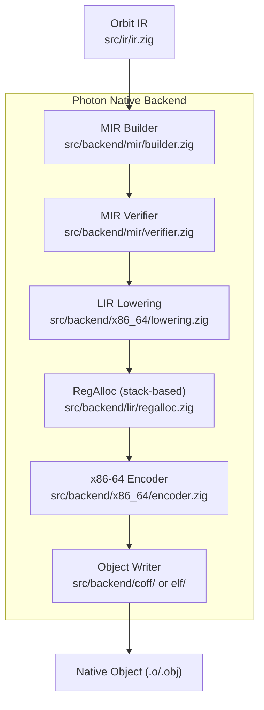

# Orbit Architecture

> Deep-dive reference for contributors and integrators.

---

## Overview

Orbit is a single-pass, ahead-of-time compiler that transforms `.orb` source files into native binaries via a C intermediate representation.  
The runtime is a small, portable C library embedded into every generated server.

---

## Compiler Pipeline



---

## Subsystem Reference

### Orbit Arena (virtual-memory epoch allocator)
File: `src/runtime/arena.c`

The arena reserves a large virtual address window (default: 256 MiB per thread) at startup and commits pages on demand.  
Every HTTP request runs inside an **epoch**:

```
orbit_arena_epoch_begin(arena)   // mark start
  … allocate request-scoped objects …
orbit_arena_epoch_end(arena)     // bulk-free everything in O(1)
```

Internally: a monotonically growing bump pointer; epoch-end resets the pointer to the epoch-start mark.  
See `docs/architecture/ORBIT_ARENA.md` for detailed design.

---

### Orbit Kynx (computational leases)
File: `src/runtime/kynx.c`

Each route handler gets a **lease** — a budget of CPU cycles and I/O operations.  
If the handler exceeds its budget, Kynx rejects the request with HTTP 429 before writing the response.  
In **siege mode** (burst of requests detected), all new leases are rejected until the server drains.

API surface:
```c
OrbitKynxLease* orbit_kynx_lease_create_for_route(const char* route, uint64_t cpu_budget);
bool            orbit_kynx_lease_check_limits(OrbitKynxLease*, size_t response_bytes);
void            orbit_kynx_lease_release(OrbitKynxLease*);
bool            orbit_kynx_is_siege_mode(void);
```

---

### Orbit Pulse (performance counters)
File: `src/runtime/pulse.c`

RDTSC-based wall-clock and CPU-cycle measurements.  
Records per-request latency into lock-free histogram buckets and computes P50 / P95 / P99 on demand.

---

### Orbit Photon (build cache)
File: `src/jit.zig`, `src/main.zig`

Caches compiled binaries keyed by `xxHash64(source)`.  
On a cache hit the compiler skips lexing → codegen and reuses the last binary.  
The cache database is stored in `~/.orbit/cache/orbit.db` (SQLite).

---

### Orbit Terminal
Files: `src/terminal/`

| File | Responsibility |
|---|---|
| `terminal.zig` | Public API |
| `capabilities.zig` | Probe `COLORTERM`, `NO_COLOR`, Windows VT mode |
| `style.zig` | ANSI escape sequences, color palettes |
| `layout.zig` | Column layout, box-drawing, progress bars |
| `symbols.zig` | Unicode / ASCII symbol selection |

---

### Orbit Atlas
File: `src/atlas.zig`

Reads `orbit.atlas` — the project config file (TOML-like).  
Provides: output name, watch mode, cache flag, anti-RE flags, SQLite inclusion.

---

## Thread Model

```
Main thread
  └── CompilationSession (main.zig)
        ├── Photon cache lookup
        ├── Lexer → Parser → Sema → IR → Codegen  (single-threaded)
        └── Spawn cc subprocess

HTTP server (generated code)
  └── Thread pool (thread_pool.c)
        └── per-request: ArenaPool.borrow() → handle → ArenaPool.return()
```

---

## File Index

| Path | Role |
|---|---|
| `src/main.zig` | Compiler driver |
| `src/lexer.zig` | Tokeniser |
| `src/token.zig` | Token enum & metadata |
| `src/ast.zig` | AST node definitions |
| `src/parser.zig` | Parser entry point |
| `src/parser/declaration_parser.zig` | Route, model, import declarations |
| `src/parser/expression_parser.zig` | Expressions |
| `src/parser/statement_parser.zig` | Statements, rescue blocks |
| `src/sema.zig` | Semantic analysis entry |
| `src/sema/type_checker.zig` | Type inference & checking |
| `src/sema/scope_manager.zig` | Lexical scope stack |
| `src/sema/model_registry.zig` | Model type registry |
| `src/sema/module_registry.zig` | Module import tracking |
| `src/sema/diagnostic.zig` | Error / warning reporting |
| `src/compiler.zig` | Orchestrates frontend → codegen |
| `src/atlas.zig` | Project configuration loader |
| `src/jit.zig` | Build cache / Photon |
| `src/ir/ir.zig` | IR instruction definitions |
| `src/ir/builder.zig` | IR construction from AST |
| `src/ir/optimizer.zig` | Constant folding, DCE |
| `src/codegen/c_backend.zig` | C code emitter (main) |
| `src/codegen/expression_gen.zig` | Expression code generation |
| `src/codegen/statement_gen.zig` | Statement code generation |
| `src/codegen/route_gen.zig` | HTTP route generation |
| `src/codegen/model_gen.zig` | ORM model generation |
| `src/codegen/runtime_loader.zig` | Embeds C runtime into output |
| `src/runtime/arena.c` | Epoch virtual-memory allocator |
| `src/runtime/arena_pool.c` | Thread-local arena pool |
| `src/runtime/http.c` | HTTP server & request parser |
| `src/runtime/database.c` | SQLite bindings |
| `src/runtime/kynx.c` | Computational leases |
| `src/runtime/pulse.c` | Performance counters |
| `src/runtime/collections.c` | Arrays, hash maps |
| `src/runtime/types.c` | Runtime type system |
| `src/runtime/auth.c` | Authentication helpers |
| `src/runtime/string_pool.c` | String interning |
| `src/runtime/thread_pool.c` | Worker thread pool |
| `src/runtime/os.c` | OS abstractions |
| `src/runtime/file.c` | File I/O helpers |
| `src/terminal/` | Compiler terminal UI |

---

## Photon Native Backend

Photon Native (`--backend=native`) compiles Orbit IR directly into relocatable machine-code object files, bypassing the C intermediate representation and avoiding external C compiler dependencies for user code.

### Native Pipeline



### Subsystems

1. **Target Abstraction (`src/backend/target.zig`)**: Detects and models the host ISA, target ABI (Windows x64 or System V AMD64), and object format (COFF or ELF).
2. **MIR (Medium Intermediate Representation)**: Target-independent CFG representation. Basic blocks trace explicit predecessor/successor links.
3. **LIR (Low Intermediate Representation)**: Target-specific register/memory representation, supporting virtual registers, stack slots, and physical register parameters.
4. **Register Allocation**: Employs a stack-based allocation strategy for absolute correctness. Virtual registers are mapped directly to stack slots. Scratch registers (RAX, RCX, RDX) are used for instruction execution.
5. **COFF/ELF object formats**: Direct implementations of the PE/COFF and ELF64 specifications, writing headers, section tables, symbol tables, and code directly into relocatable objects.

