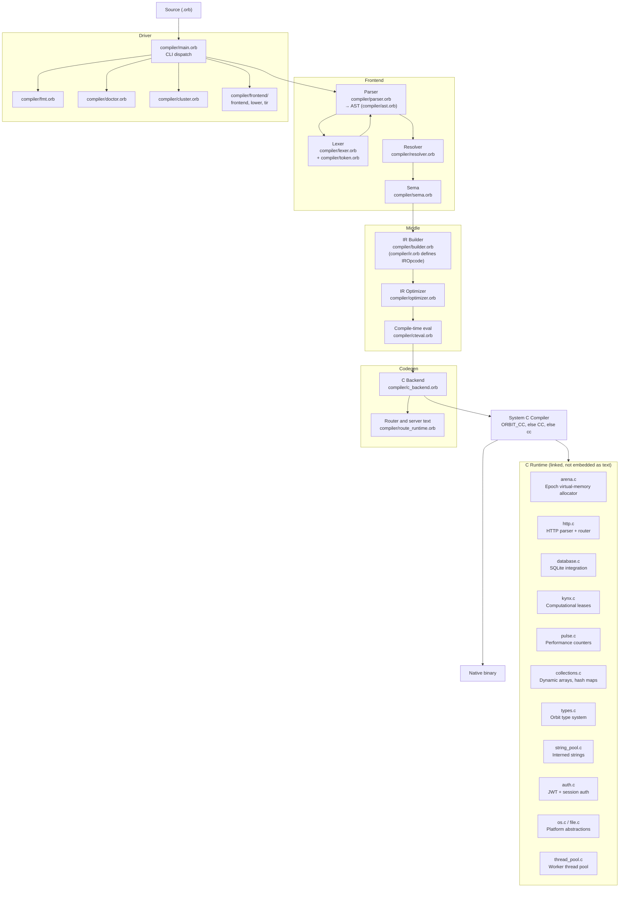

# Orbit Architecture

> Deep-dive reference for contributors and integrators. This page describes the
> architecture that exists today: the self-hosted pipeline in `compiler/`, the C
> runtime in `runtime/`, the gates in `scripts/`, and the test corpora in
> `tests/`. For the bootstrap trust model see
> [architecture/SOVEREIGNTY.md](architecture/SOVEREIGNTY.md).

---

## Overview

Orbit is an ahead-of-time compiler that turns `.orb` source into native binaries
through C. The compiler is written in its own language, in `compiler/*.orb`, and
bootstraps from a committed C file that it generated itself. The runtime is a
small, portable C library linked into every generated server.

If you're new, you don't need this file yet. Build something first with
[Getting Started](GETTING_STARTED.md), then come back when you want to know how
the pieces fit.

---

## Compiler Pipeline

One driver, `compiler/pipeline.orb`, calls each stage in order. The lexer is
driven by the parser: `initParser` owns a `Lexer` and pulls tokens from it, so
lexing and parsing are one pass, not two.


```mermaid
flowchart TD
    SRC["Source (.orb)"]

    subgraph Frontend
        LEX["Lexer\ncompiler/lexer.orb\n+ compiler/token.orb"]
        PAR["Parser\ncompiler/parser.orb\n→ AST (compiler/ast.orb)"]
        RES["Resolver\ncompiler/resolver.orb"]
        SEM["Sema\ncompiler/sema.orb"]
    end

    subgraph Middle
        IR["IR Builder\ncompiler/builder.orb\n(compiler/ir.orb defines IROpcode)"]
        OPT["IR Optimizer\ncompiler/optimizer.orb"]
        CTE["Compile-time eval\ncompiler/cteval.orb"]
    end

    subgraph Codegen
        CBK["C Backend\ncompiler/c_backend.orb"]
        RTM["Router and server text\ncompiler/route_runtime.orb"]
    end

    subgraph Runtime["C Runtime (linked, not embedded as text)"]
        ARN["arena.c\nEpoch virtual-memory allocator"]
        HTTP["http.c\nHTTP parser + router"]
        DB["database.c\nSQLite integration"]
        KYN["kynx.c\nComputational leases"]
        PLS["pulse.c\nPerformance counters"]
        COL["collections.c\nDynamic arrays, hash maps"]
        TYP["types.c\nOrbit type system"]
        STR["string_pool.c\nInterned strings"]
        AUTH["auth.c\nJWT + session auth"]
        OS["os.c / file.c\nPlatform abstractions"]
        THR["thread_pool.c\nWorker thread pool"]
    end

    subgraph Driver
        MAIN["compiler/main.orb\nCLI dispatch"]
        FMT["compiler/fmt.orb"]
        DOC["compiler/doctor.orb"]
        CLU["compiler/cluster.orb"]
        FE["compiler/frontend/\nfrontend, lower, tir"]
    end

    SRC --> MAIN
    MAIN --> PAR
    PAR --> LEX
    LEX --> PAR
    PAR --> RES --> SEM --> IR
    IR --> OPT --> CTE --> CBK
    CBK --> RTM
    CBK --> CC["System C Compiler\nORBIT_CC, else CC, else cc"]
    CC --> BIN["Native binary"]
    CC --> Runtime
    MAIN --> FMT
    MAIN --> DOC
    MAIN --> CLU
    MAIN --> FE
```

### Stage notes

| Stage | Module | What it does | On failure |
|---|---|---|---|
| Parse | `compiler/parser.orb` | Build the AST. Member names after `.` accept keyword and type tokens and resolve by text. | `ParserDiagnostic` rendered as an error card with a source excerpt and a hint. |
| Resolve | `compiler/resolver.orb` | Load `import`ed modules, flatten them into one AST. | `Import error: <detail>` per unresolved import, exit non-zero. |
| Sema | `compiler/sema.orb` | Scope and type resolution. Builds the function return-type table the builder and backend read. | First error rendered as an error card; remaining errors listed to stderr. |
| Build | `compiler/builder.orb` | AST to IR. `IRModule` of `IRInstruction` over the `IROpcode` union: arithmetic, comparison, control flow, calls, `alloc`/`free`, field access, the collection opcodes, the `result_*` opcodes, and the union opcodes. | No failure path of its own. Sema has already rejected bad code; an expression the builder cannot type degrades to `unknown` in the IR rather than aborting, which is why STAB-5 in [ENGINEERING.md](../ENGINEERING.md) wants an IR type-consistency verifier. |
| Optimize | `compiler/optimizer.orb` | Pattern rewrites over the IR; reports `patterns_applied` and `span_saved`. | Not fatal. |
| CTE | `compiler/cteval.orb` | Compile-time evaluation and folding; reports fold count. | Not fatal. |
| C backend | `compiler/c_backend.orb` | Emits C. Routes take a separate path: `compiler/route_runtime.orb` supplies the preamble, router, and `main` as generated text, and the route hash is a 64-bit FNV-1a over `METHOD + ':' + PATH`. | No failure path of its own; the driver reports an unwritable output path or a non-zero exit from the C compiler. |
| Invoke `cc` | `compiler/pipeline.orb` | Writes the C to a **constant** filename, then invokes the C compiler. | The child's exit code and output are surfaced verbatim. |

Both optimization passes honour the same kill switch: `ORBIT_NO_CTE=1` skips
them and emits pre-pass IR, and their counters are reported rather than dropped.

### Why the intermediate C has a constant name

`compiler/pipeline.orb` writes the generated C to `orbit_selfhost_build.c` under
`TEMP`, not to a name derived from the output. C compilers embed the source path
in anonymous-struct names and in type diagnostics, so a name derived from the
output (`stage2.exe.c` versus `stage3.exe.c`) would break the fixed-point
comparison even when the emitted code is byte-identical. This one choice is what
makes "did the compiler change its mind?" answerable as a hash comparison.

### Linking the runtime

The generated C is compiled with `-I runtime`. The runtime's `runtime.h` is an
aggregation header: it includes the `.c` files directly, so there is no separate
library to build or ship. The driver adds `-DORBIT_WITH_NET` unconditionally, and
adds `-DORBIT_WITH_DB` plus the vendor SQLite flags only when the IR actually
uses the database. On Windows it adds `-lws2_32`; on the DB path it links
`runtime/vendor/win-x64/sqlite3.lib` instead of `-lsqlite3`.

Warnings: the self-host invocation uses `-Wall` with
`-Wno-error=int-conversion -Wno-error=incompatible-pointer-types`, which are
errors by default on GCC 14+ and would otherwise break user builds over the
remaining untyped-emission patterns. Full `-Werror` cleanliness is tracked by
`scripts/werror_gate.py`, and `ORBIT_CCFLAGS_EXTRA` is the escape hatch the
bootstrap uses for its own low-memory profile.

---

## Self-Hosting Chain

The compiler is its own first customer. `compiler/selfhost/stage3.exe.c` is the
committed output of the compiler compiling itself, and it is the root of trust.

```text
compiler/selfhost/stage3.exe.c   (committed canonical, 3,928,804 bytes)
        │  any C compiler: cc, clang, gcc, cl
        ▼
   seed compiler  ──builds──▶  compiler/main.orb
        │                        │
        │                        ▼
        │                  the same canonical C, byte for byte
        ▼
   seed2 ──▶ chain2 ──▶ chain3
```

`scripts/verify_seed.py` runs that chain and reports four checks: the seed
builds; the C the seed emits for `compiler/main.orb` equals the canonical; the C
emitted by chain2 equals the canonical; the C emitted by chain3 equals the
canonical. The last two exist because a chain can fix a point at stage one and
drift afterwards.

There is exactly one lineage. `scripts/build_selfhost.py --promote` is the only
operation that replaces the canonical, and it is deliberate and reviewable. See
[architecture/SOVEREIGNTY.md](architecture/SOVEREIGNTY.md) for the full trust
model and [architecture/BOOTSTRAP_STAGES.md](architecture/BOOTSTRAP_STAGES.md)
for what each stage is.

---

## Subsystem Reference

### Orbit Arena (virtual-memory epoch allocator)
File: `runtime/arena.c`

The arena reserves a large virtual address window at startup and commits pages on
demand.
Every HTTP request runs inside an **epoch**, bracketed by checkpoint/rewind:

```c
OrbitArenaCheckpoint mark = orbit_arena_checkpoint(arena);  // mark start
  /* allocate request-scoped objects */
orbit_arena_rewind(arena, mark);                            // bulk-free everything in O(1)
```

Internally: a monotonically growing bump pointer; rewind resets the pointer to the
checkpoint mark.
`orbit_arena_reset(arena)` returns the arena to a pristine state.
`runtime/arena_pool.c` keeps a pool of arenas so a worker borrows one per request
instead of creating it.
See [architecture/ORBIT_ARENA.md](architecture/ORBIT_ARENA.md) and [ARENA.md](ARENA.md).

---

### Orbit Kynx (computational leases)
File: `runtime/kynx.c`

Each route handler gets a **lease**: a budget of CPU time, arena memory,
DB queries, and response size.
If the handler exceeds its budget, Kynx rejects the request with HTTP 429 before writing the response.
Under pressure the admission state machine (STABLE / SHAPED / GUARDED / SIEGE)
tightens budgets; in **SIEGE** only critical routes (`/health`, `/auth`, `/`)
keep an emergency budget and the rest are rejected. See [KYNX.md](KYNX.md).

The lease and admission API lives in `runtime/kynx.c`; the unit tests are
`runtime/test_kynx.c`, built with `-DORBIT_KYNX_TEST`. A live route-limit gate
runs against a real server: `scripts/kynx_route_limit_gate.py`.

---

### Orbit Pulse (performance counters)
File: `runtime/pulse.c`

RDTSC-based wall-clock and CPU-cycle measurements.
Records per-request latency into lock-free histogram buckets and computes P50 / P95 / P99 on demand.
The hardware energy accounting sits alongside it rather than on top of it:
`runtime/energy.c` samples the platform energy sensor on its own thread and
`runtime/ledger.c` records the accounting entries. See [ENERGY.md](ENERGY.md).

---

### Orbit Cluster (single-host process orchestration)
File: `compiler/cluster.orb`

`orbit cluster` builds and supervises N local processes of one service:
`up`, `status`, `drain <node>`, `restart --rolling`, `down`, `logs <node>`.
Node state lives in `.orbit/cluster.json`; logs default to `.orbit/logs`.
Nodes are on one host, on consecutive ports from a base. This is process
supervision, not a distributed cluster: there is no gossip, no membership table,
and no leader election. See [CLUSTER.md](CLUSTER.md).

---

### Frontend canonical TIR
Files: `compiler/frontend/frontend.orb`, `lower.orb`, `tir.orb`

`orbit frontend <file.orb> -o out.tir` runs the self-hosted frontend alone and
emits canonical typed IR, without invoking the C backend. It is the debugging
surface for the frontend and the fixture format for `tests/frontend/expected/`.
See [architecture/TYPED_IR.md](architecture/TYPED_IR.md).

---

### Formatter and Doctor
Files: `compiler/fmt.orb`, `compiler/doctor.orb`

`orbit fmt` formats `.orb` source and writes only on success; `orbit fmt --check`
lists files that need formatting. `orbit doctor` is a read-only project scan
reporting findings `D001` through `D008` (toolchain, route conflicts, unused
`private fn`, unused `model`, unknown `system` member, trailing whitespace,
missing final newline, and files that do not compile). See
[DOCTOR.md](DOCTOR.md).

### There Is No Build Cache and No Config Loader

Two subsystems that earlier revisions of this document described no longer exist.
There is no compiled-binary cache keyed on a source hash: every build runs the
pipeline. And nothing reads an `orbit.atlas` project file, so the output name,
port, and the arena/Kynx/logging knobs are not currently read from a config
file. `scripts/orbit_ccache.py` caches C compilations for the **bootstrap gates
only**; it does not cache user builds, and it is not part of the compiler.

---

## Thread Model

```text
Main thread
  └── compiler/main.orb
        ├── lex → parse → resolve → sema → build → optimize → cteval → C  (single-threaded)
        ├── write the generated C
        └── spawn the C compiler subprocess

HTTP server (generated code)
  └── worker pool (runtime/thread_pool.c, count from ORBIT_WORKERS or the CPU count)
        └── per-request: borrow an arena → handle → return it
```

Worker count is resolved in the generated `main`: `ORBIT_WORKERS` if positive,
otherwise the platform CPU count, clamped to 1..64, and printed in the startup
banner. The acceptor hands sockets to workers through a lock-free queue, so
contention is on the queue and not on a shared stdout lock.

---

## File Index

### Compiler (Orbit source, `compiler/`)

| Path | Role |
|---|---|
| `compiler/pipeline.orb` | Build driver: stage order, C emission, C compiler invocation |
| `compiler/main.orb` | CLI entry point and subcommand dispatch |
| `compiler/lexer.orb` | Tokeniser (skips a leading UTF-8 BOM) |
| `compiler/token.orb` | Token type and metadata |
| `compiler/ast.orb` | AST node definitions |
| `compiler/parser.orb` | Parser entry point |
| `compiler/resolver.orb` | `import` resolution and module flattening |
| `compiler/sema.orb` | Semantic analysis, scopes, function return types |
| `compiler/ir.orb` | `IROpcode`, `IRInstruction`, `IRModule` |
| `compiler/builder.orb` | AST to IR, plus expression and argument type inference |
| `compiler/optimizer.orb` | IR pattern rewrites |
| `compiler/cteval.orb` | Compile-time evaluation and folding |
| `compiler/c_backend.orb` | IR to C, including the non-route path |
| `compiler/route_runtime.orb` | Generated preamble, router, and server `main` text |
| `compiler/cluster.orb` | `orbit cluster` subcommands |
| `compiler/doctor.orb` | `orbit doctor` checks and rendering |
| `compiler/fmt.orb` | `orbit fmt` |
| `compiler/extern.orb` | `orbit_*_selfhost` extern declarations (typed) |
| `compiler/frontend/frontend.orb` | `orbit frontend` driver |
| `compiler/frontend/lower.orb` | AST to typed IR lowering |
| `compiler/frontend/tir.orb` | Canonical TIR definitions and serialisation |
| `compiler/selfhost/stage3.exe.c` | Committed canonical generated C, the root of trust |

### Runtime (hand-written C, `runtime/`)

| Path | Role |
|---|---|
| `runtime/runtime.h` | Aggregation header; includes the `.c` files |
| `runtime/arena.c` | Epoch virtual-memory allocator |
| `runtime/arena_pool.c` | Pool of arenas for per-request use |
| `runtime/oracle.c` | Arena telemetry oracle |
| `runtime/string_pool.c` | String interning |
| `runtime/collections.c` | Arrays, hash maps, bytes |
| `runtime/types.c` | Runtime type system |
| `runtime/file.c` | File I/O helpers |
| `runtime/os.c` | OS abstractions |
| `runtime/builtins.c` | Builtin functions exposed to generated code |
| `runtime/crypto.c` | Hashing and crypto primitives |
| `runtime/hyperdrive.c` | Throughput-oriented runtime helpers |
| `runtime/selfhost.c` | Host services the compiler itself uses (exec, files, env) |
| `runtime/energy.c` | Energy accounting |
| `runtime/ledger.c` | Ledger and accounting records |
| `runtime/database.c` | SQLite bindings and model persistence |
| `runtime/auth.c` | JWT and session auth |
| `runtime/http.c` | HTTP server, request parser, router |
| `runtime/kynx.c` | Computational leases and admission control |
| `runtime/pulse.c` | Performance counters |
| `runtime/thread_pool.c` | Worker thread pool |
| `runtime/inline.h`, `performance.h`, `socket_compat.h` | Shared headers |
| `runtime/vendor/` | SQLite: `sqlite3.h` and the `win-x64` import library and DLL |
| `runtime/test_arena.c` | Arena unit tests, including cross-request isolation |
| `runtime/test_http_parse.c` | HTTP parser unit tests |
| `runtime/test_kynx.c` | Kynx unit tests (needs `-DORBIT_KYNX_TEST`) |

### Standard library and wrappers

| Path | Role |
|---|---|
| `std/` | Orbit standard library modules: `test/assert.orb`, `string/string.orb`, `collections/lists.orb`, `bytes`, `core`, `fs`, `hash`, `io`, `log`, `sys`, `time` |
| `lib/arena.orb` | Thin wrapper over the arena runtime externs |
| `lib/net.orb` | Thin wrapper over the network runtime externs |
| `lib/sys/linux.orb`, `lib/sys/windows.orb` | Platform-specific extern wrappers |

### Gates and tooling (`scripts/`, Python 3, standard library only)

| Path | Role |
|---|---|
| `scripts/build_selfhost.py` | Bootstrap the self-hosted compiler; `--check-stale` for CI, `--promote` to replace the canonical |
| `scripts/verify_seed.py` | Hermetic fixed-point chain; `--release` pins the published hash |
| `scripts/parity_selfhost.py` | 32 probes against 32 goldens; `--update` to regenerate |
| `scripts/test_suite.py` | Language and std behaviour suites, driven by process exit code |
| `scripts/werror_gate.py` | `-Werror` over generated C |
| `scripts/fuzz_frontend.py` | Frontend fuzzing |
| `scripts/cli_probe.py` | CLI subcommand, help, and exit-code contract |
| `scripts/routes_probe.py` | Route argument normalisation |
| `scripts/kynx_route_limit_gate.py` | Live Kynx route-limit gate against a running server |
| `scripts/amalgamate.py` | Inline the project includes into `dist/orbit_bootstrap.c` |
| `scripts/orbit_ccache.py` | Content-addressed C compile cache for the bootstrap gates |
| `scripts/orbit_routes.py` | Path normalisation shared by gates and the server |
| `scripts/orbit_output.py` | Shared gate output helpers |
| `scripts/measure_selfhost.py` | Bootstrap-side measurement |
| `scripts/night_load.py` | Load generator for live-service measurement |
| `scripts/build_seed.sh`, `.bat` | Detect a C compiler and build the seed |
| `scripts/install.sh`, `install.ps1` | Install the fixed-point compiler on `PATH` |

---

## Tests

| Corpus | Location | How it runs | Assertion |
|---|---|---|---|
| Language behaviour | `tests/suite/` (25 runnable `.orb` tests) | `scripts/test_suite.py` | The test program compiles, runs, and its **exit code** matches `// expect-exit <N>`. |
| Standard library | `tests/std/` (13 `.orb` tests) | `scripts/test_suite.py --dir tests/std` | Same convention. |
| Parity | `tests/parity/probes/` (32 `.orb`) + `tests/parity/golden/` (32) | `scripts/parity_selfhost.py` | For an exit-0 probe, the SHA-256 of the generated C matches the golden. For a non-zero probe, the normalised diagnostics match. |
| Frontend TIR | `tests/frontend/` (6 `.orb`) + `expected/` (4 `.tir`) | `orbit frontend` | The emitted canonical TIR matches the expected file. |
| Runtime C | `runtime/test_arena.c`, `test_http_parse.c`, `test_kynx.c` | compiled and run directly | The C harness's own assertions. |
| Auth | `tests/auth/auth_harness.c` | compiled and run directly | Bearer token, role, and `has_role` behaviour against the real runtime. |
| Doctor | `tests/doctor/` | `orbit doctor tests/doctor` (manual) | Exactly one `D002`, no finding for two methods sharing a path, exit code 1. |

Everything above runs in CI on ubuntu/gcc and windows/clang, plus an
eight-leg stress job that re-runs the fixed-point chain independently to hunt
run-to-run flakiness. The full gate sequence, in order, is in
[ENGINEERING.md](../ENGINEERING.md) §8.

---

## Native Backend

**Not implemented.** There is no `--backend=native`, no `compiler/native/`
directory, and no `orbit bootstrap` subcommand. The only backend is C, and the
only build entry points are `orbit build`, `run`, and `check`.

It remains the largest open architecture item, tracked as SOVER-1 in
[ENGINEERING.md](../ENGINEERING.md) and as Phase S2 in that document's
self-hosting roadmap. The design it would have to satisfy, including the
component breakdown and the parity requirement, is recorded there. The current
state of the requirement is worth stating plainly: the intended goal is to lower
the existing `IRModule` to machine code and write relocatable PE/COFF and ELF64
objects directly, so a user program can be built without a system C compiler for
its own code, and the native and C paths must be shown to produce identical
output for the same input before it is real.
