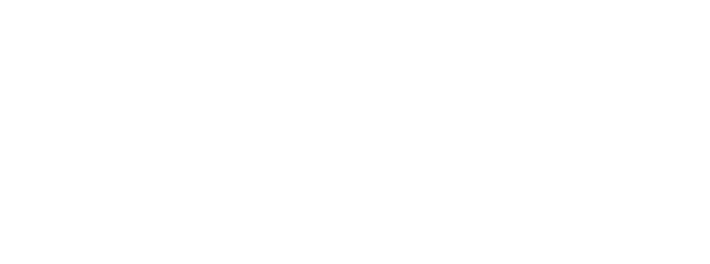

# Orbit Programming Language

[](https://opensource.org/licenses/MIT)
[](../../docs/STATUS.md)


Syntax highlighting and `orbit check` diagnostics for **Orbit** - a statically
typed language for APIs and microservices.

## There is no language server

This extension does not start one, and it is not a missing feature waiting on
a version bump. `orbit` has no `lsp` subcommand:

```console
$ orbit lsp
Unknown command: lsp
Usage: orbit <command> [options]
...
$ echo $?
2
```

An earlier version of this extension spawned `orbit lsp` anyway, so every
activation ended in an error notification and the extension did nothing. If you
want completion, hover text or go-to-definition, they have to be built inside
the compiler first; until then what is here is what the compiler can actually
do.

## What it does

- **Highlighting** for the keywords `orbit` actually lexes, taken from
  `matchKeyword` in `compiler/lexer.orb` - including hex and
  digit-separated numbers, `"""` raw strings, `'c'` character literals and
  `${...}` interpolation holes.
- **Diagnostics on save.** The extension runs `orbit check <file>` and puts
  what comes back in the Problems panel. Save a clean file and the list
  empties.
- **`Orbit: Check File`** from the Command Palette, or click the status bar
  item.
- **`Orbit: Build and Run File`**, which opens a terminal and runs
  `orbit run <file>` so the server keeps the terminal.

If no `orbit` binary is found, the extension says so once, leaves the status
bar greyed out, and keeps highlighting. It does not throw.

## Quickstart & Installation

### Option 1: Automated Script Installation

If you installed Orbit via the automated installer, the VS Code extension was registered automatically:

**Windows (PowerShell)**:
```powershell
powershell -ExecutionPolicy Bypass -File scripts/install.ps1
```

**Linux / macOS (Bash)**:
```bash
bash scripts/install.sh
```

### Option 2: Manual VSIX Installation

1. Build the extension package:
   ```bash
   cd editors/vscode
   npx @vscode/vsce package
   ```
2. Install in VS Code:
   ```bash
   code --install-extension orbit-0.1.0.vsix
   ```

---

## Configuration Settings

| Setting | Type | Default | Description |
| :--- | :--- | :--- | :--- |
| `orbit.executablePath` | `string` | `""` | Absolute path to the `orbit` or `orbit.exe` binary. Empty searches `PATH`, then `~/.orbit/bin`, then the workspace root. |

---

## Syntax Highlighting Preview

Everything below is a program `orbit check` accepts. The declaration forms
`port`, `cors`, `db` and `env` are **parsed and then discarded** - the
generated server hardcodes port 3000 and takes an override from `argv[1]` -
so they are syntax to read, not settings to rely on.

```orbit
// A config declaration parses. It does not configure anything today.
port 3000

model User {
    id: string
    email: string
    role: string
}

@auth
route GET "/users" {
    val users = User.all()
    return users
}

// Types are the six lowercase names. `Int` is accepted and becomes `void*`.
fn count(list: list) -> int {
    return list.len()
}
```

## Running the parser test

The diagnostic parser has no VS Code dependency and no test framework:

```bash
node editors/vscode/test/diagnostics_test.js
```

---

## License

Distributed under the **MIT License**. See [LICENSE](../../LICENSE) for more information.
